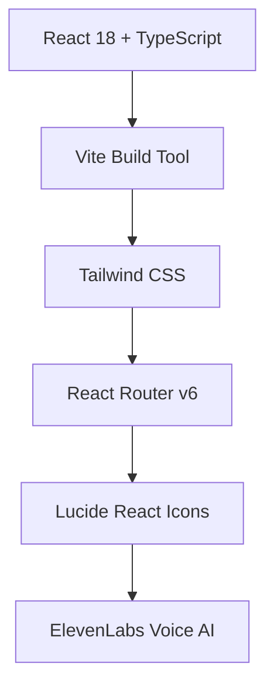
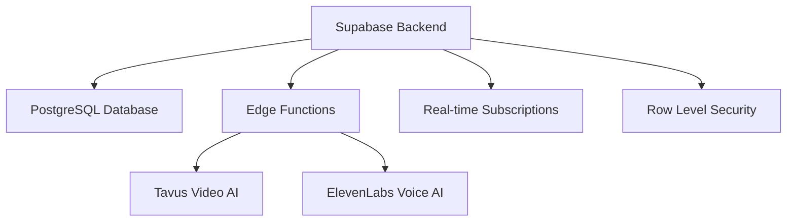

# 🌟 Arami Space - AI-Powered Emotional Wellness Companion

<div align="center">


_A voice-first emotional AI companion that provides personalized daily rituals through conversational AI_

[🚀 Live Demo](#) • [📖 Documentation](./specs/) • [🐛 Report Bug](#) • [💡 Request Feature](#)

</div>

---

## 📋 Table of Contents

- [✨ Features](#-features)
- [🏗️ Architecture](#️-architecture)
- [🚀 Quick Start](#-quick-start)
- [💻 Development](#-development)
- [🔧 Configuration](#-configuration)
- [📱 Mobile Optimization](#-mobile-optimization)
- [🧪 Testing](#-testing)
- [🚢 Deployment](#-deployment)
- [📚 API Documentation](#-api-documentation)
- [🤝 Contributing](#-contributing)
- [📄 License](#-license)

---

## ✨ Features

### 🎯 Core Functionality

- **🎙️ Voice-First Onboarding**: AI-powered personality discovery through natural conversation with Genesis agent
- **🧠 Intelligent AI Mentoring**: Personalized video sessions with AI mentors powered by Tavus
- **📊 Comprehensive Dashboard**: Real-time progress tracking, analytics, and personal insights
- **🎯 Goal Management**: SMART goal setting with progress tracking and achievement monitoring
- **💎 Virtue Collection**: Gamified virtue system with rarity levels and streak tracking
- **📱 Mobile-First Design**: Optimized for iPhone 16 Pro with responsive web design

### 🔐 Authentication & Security

- **🔗 Magic Link Authentication**: Seamless email-based authentication
- **📱 Phone Verification**: Two-factor authentication with SMS verification
- **🛡️ Row-Level Security**: Comprehensive data protection with Supabase RLS
- **🔄 Smart Redirects**: Intelligent routing based on user onboarding status

### 🎨 User Experience

- **🌙 Beautiful UI/UX**: Modern design system with Tailwind CSS
- **♿ Accessibility**: WCAG 2.1 AA compliant with full keyboard navigation
- **⚡ Performance**: Optimized for 60fps animations and fast mobile networks
- **🔄 Real-time Updates**: Live data synchronization across all components

---

## 🏗️ Architecture

### Frontend Stack



### Backend Infrastructure



### Key Technologies

| Category       | Technology            | Purpose                                          |
| -------------- | --------------------- | ------------------------------------------------ |
| **Frontend**   | React 18 + TypeScript | Modern, type-safe UI development                 |
| **Build Tool** | Vite                  | Fast development and optimized builds            |
| **Styling**    | Tailwind CSS          | Utility-first CSS framework                      |
| **Backend**    | Supabase              | Database, authentication, and real-time features |
| **Voice AI**   | ElevenLabs            | Conversational AI for onboarding                 |
| **Video AI**   | Tavus                 | AI mentor video sessions                         |
| **Icons**      | Lucide React          | Consistent, beautiful icons                      |

---

## 🚀 Quick Start

### Prerequisites

- **Node.js** 18+
- **npm** or **yarn**
- **Supabase Account** (for backend services)
- **ElevenLabs API Key** (for voice features)
- **Tavus API Key** (for video mentoring)

### Installation

1. **Clone the repository**

   ```bash
   git clone https://github.com/yourusername/arami-space.git
   cd arami-space
   ```

2. **Install dependencies**

   ```bash
   npm install
   ```

3. **Set up environment variables**

   ```bash
   cp .env.example .env.local
   ```

   Configure your `.env.local`:

   ```env
   VITE_SUPABASE_URL=your_supabase_url
   VITE_SUPABASE_ANON_KEY=your_supabase_anon_key
   ```

4. **Start development server**

   ```bash
   npm run dev
   ```

5. **Open your browser**
   Navigate to `http://localhost:5173`

---

## 💻 Development

### Project Structure

```
arami-space/
├── src/
│   ├── components/          # Reusable UI components
│   │   ├── auth/           # Authentication components
│   │   ├── landing/        # Landing page sections
│   │   ├── layout/         # Layout and navigation
│   │   ├── onboarding/     # Onboarding flow components
│   │   ├── profile/        # User profile components
│   │   ├── session/        # Session management
│   │   └── ui/             # Core UI components
│   ├── hooks/              # Custom React hooks
│   ├── lib/                # Utilities and services
│   ├── pages/              # Page components
│   ├── types/              # TypeScript type definitions
│   └── data/               # Static data and configurations
├── supabase/
│   ├── functions/          # Edge functions
│   └── migrations/         # Database migrations
└── specs/                  # Project documentation
```

### Available Scripts

| Command           | Description              |
| ----------------- | ------------------------ |
| `npm run dev`     | Start development server |
| `npm run build`   | Build for production     |
| `npm run preview` | Preview production build |
| `npm run lint`    | Run ESLint               |

### Code Style & Standards

- **TypeScript**: Strict mode enabled for type safety
- **ESLint**: Enforced code quality standards
- **Prettier**: Consistent code formatting
- **Conventional Commits**: Standardized commit messages

---

## 🔧 Configuration

### Environment Variables

#### Frontend Configuration

```env
# Supabase Configuration
VITE_SUPABASE_URL=https://your-project.supabase.co
VITE_SUPABASE_ANON_KEY=your_anon_key

# AI Services
VITE_ELEVENLABS_API_KEY=your_elevenlabs_key
```

#### Backend Configuration (Supabase Edge Functions)

```env
# Supabase Service
SUPABASE_URL=https://your-project.supabase.co
SUPABASE_SERVICE_ROLE_KEY=your_service_role_key

# External APIs
TAVUS_API_KEY=your_tavus_api_key
ELEVENLABS_API_KEY=your_elevenlabs_key
```

### Supabase Setup

1. **Create a new Supabase project**
2. **Run migrations**
   ```bash
   npx supabase db push
   ```
3. **Deploy Edge Functions**
   ```bash
   npx supabase functions deploy
   ```

---

## 📱 Mobile Optimization

### Target Devices

- **Primary**: iPhone 16 Pro (393×852px @ 3x density)
- **Secondary**: Modern Android devices
- **Responsive**: Tablets and desktop browsers

### Mobile-First Features

- **Safe Area Handling**: iOS safe area support with `env(safe-area-inset-*)`
- **Touch Optimization**: 44px minimum touch targets
- **Performance**: Lazy loading and code splitting
- **Offline Graceful**: Handles network interruptions
- **PWA Ready**: Manifest and service worker support

### Design Principles

- **Fixed-Box Layout**: Containers with internal scrolling
- **Bottom Navigation**: Thumb-friendly mobile navigation
- **Voice-First**: Optimized for voice interactions
- **Accessibility**: Full keyboard and screen reader support

---

## 🚢 Deployment

### Production Build

```bash
# Create optimized production build
npm run build

# Preview production build locally
npm run preview
```

### Deployment Options

#### Vercel (Recommended)

```bash
# Install Vercel CLI
npm i -g vercel

# Deploy to Vercel
vercel --prod
```

#### Netlify

```bash
# Build and deploy
npm run build
# Upload dist/ folder to Netlify
```

#### Self-Hosted

```bash
# Build the project
npm run build

# Serve the dist/ folder with any static file server
npx serve dist
```

### Environment Setup

1. **Configure environment variables** in your deployment platform
2. **Set up Supabase Edge Functions** deployment
3. **Configure domain and SSL** certificates
4. **Set up monitoring** and analytics

---

## 📚 API Documentation

### Edge Functions

| Function              | Purpose                          | Endpoint                                 |
| --------------------- | -------------------------------- | ---------------------------------------- |
| `start-tavus-session` | Initiate AI mentor video session | `POST /functions/v1/start-tavus-session` |
| `end-tavus-session`   | Terminate video session          | `POST /functions/v1/end-tavus-session`   |
| `tavus-webhook`       | Process session webhooks         | `POST /functions/v1/tavus-webhook`       |
| `auth-magic-link`     | Handle magic link authentication | `POST /functions/v1/auth-magic-link`     |
| `auth-phone`          | Handle phone verification        | `POST /functions/v1/auth-phone`          |

### Database Schema

- **Users & Profiles**: User management and profile data
- **Onboarding**: Personality assessment and preferences
- **Goals**: User goal tracking and progress
- **Sessions**: AI mentor session management
- **Virtues**: Gamification and achievement system

For detailed API documentation, see [API Documentation](./specs/api-documentation.md).

---

## 🤝 Contributing

We welcome contributions to Arami Space! Please follow these guidelines:

### Development Workflow

1. **Fork the repository**
2. **Create a feature branch**
   ```bash
   git checkout -b feature/amazing-feature
   ```
3. **Make your changes**
4. **Run tests and linting**
   ```bash
   npm run lint
   npm test
   ```
5. **Commit your changes**
   ```bash
   git commit -m "feat: add amazing feature"
   ```
6. **Push to your branch**
   ```bash
   git push origin feature/amazing-feature
   ```
7. **Open a Pull Request**

### Code Standards

- Follow existing code style and conventions
- Add tests for new features
- Update documentation as needed
- Ensure accessibility compliance
- Test on mobile devices

### Project Management

- Review [Project Plan](./specs/project-plan.md) for current roadmap
- Check [Memory](./specs/memory.md) for task status
- Check [Changelog](./specs/changelog.md) for updates
- Follow [Design System](./specs/arami-design-system.md) guidelines

---

## 🙏 Acknowledgments

- **ElevenLabs** for conversational AI technology
- **Tavus** for AI video mentor capabilities
- **Supabase** for backend infrastructure
- **React Team** for the amazing framework
- **Tailwind CSS** for the utility-first CSS framework

---

<div align="center">

**Made with ❤️ by the Arami Team**

[🌟 Star this repo](https://github.com/ramigonzalez/arami-space) • [🐛 Report Issues](https://github.com/ramigonzalez/arami-space/issues)

</div>
